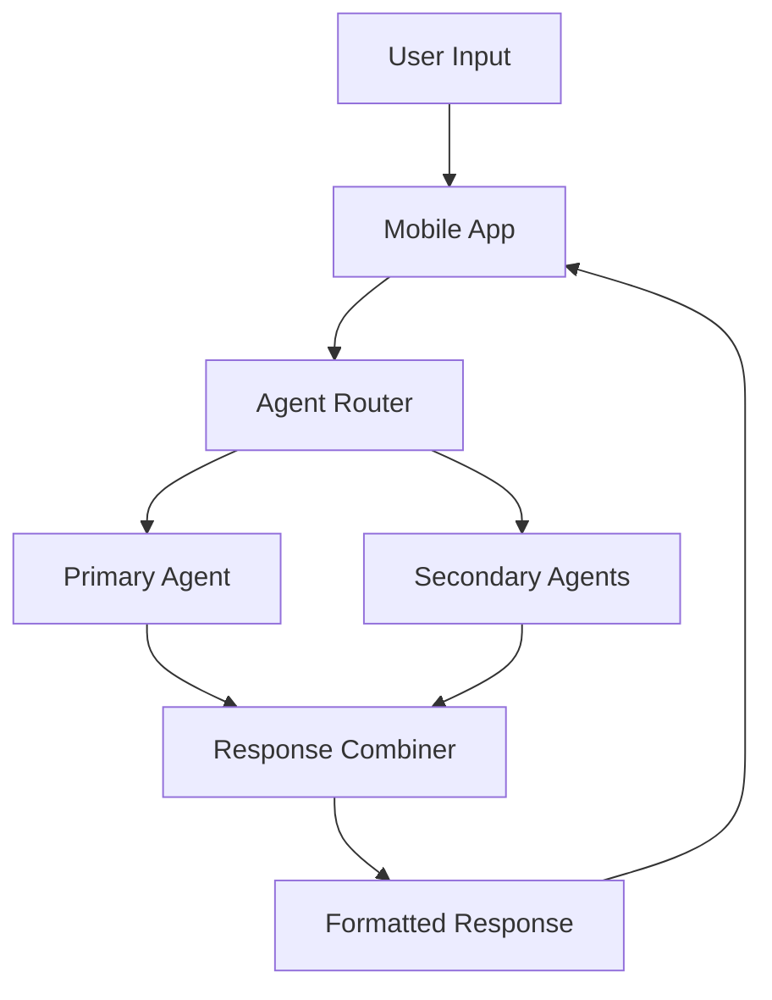

# System Design

## Overview

The Green Thumb AI agent swarm is built on the ElizaOS framework, utilizing its agent-based architecture to create a collaborative system of specialized AI agents. This document outlines the technical architecture and design decisions.

## System Architecture

### 1. Core Components

#### Web Browser Layer
- React (or Next.js) web frontend
- Responsive design for desktop and mobile browsers
- Connects to the same backend and agent swarm as the mobile app
- Supports all major browsers (Chrome, Firefox, Safari, Edge)

#### Mobile Application Layer
- React Native frontend
- Real-time communication with agent swarm
- Offline capability for basic queries
- Push notification system

#### Agent Layer
- Multiple specialized AI agents
- Inter-agent communication system
- Shared knowledge base
- Memory management system

#### Data Layer
- Vector database for semantic search
- User data storage
- Knowledge base storage
- Analytics and logging

### 2. Agent Communication Flow

1. **User Input Processing**
   - User submits a query via the mobile app **or** web browser
   - Query is routed to appropriate agent(s)
   - Context is gathered from relevant providers

2. **Agent Collaboration**
   - Primary agent handles main query
   - Secondary agents provide supplementary information
   - Results are combined and formatted

3. **Response Generation**
   - Response is generated based on agent collaboration
   - Response is formatted for mobile display
   - Additional resources are attached if needed

### 3. Data Flow

## Technical Decisions

### 1. Framework Selection
- **ElizaOS**: Chosen for its robust agent architecture and extensibility
- **React Native**: Selected for cross-platform mobile development
- **Vector Database**: For efficient semantic search and knowledge retrieval

### 2. Security Considerations
- End-to-end encryption for user data
- Secure API communication
- Regular security audits
- GDPR compliance measures

### 3. Scalability
- Microservices architecture
- Load balancing for agent distribution
- Caching system for frequent queries
- Database sharding for large-scale deployment

## Development Phases

### Phase 1: Foundation
- Basic project setup
- Core agent framework implementation
- Mobile app shell development

### Phase 2: Agent Development
- Individual agent implementation
- Inter-agent communication
- Knowledge base development

### Phase 3: Mobile Integration
- UI/UX implementation
- Real-time communication
- Offline capabilities

### Phase 4: Testing & Optimization
- Performance testing
- User testing
- Knowledge base validation

## Future Considerations

1. **Scalability**
   - Additional agent types
   - Enhanced collaboration capabilities
   - Advanced analytics

2. **Integration**
   - IoT device support
   - Weather API integration
   - Community features

3. **Advanced Features**
   - AR plant identification
   - Automated growing system integration
   - Advanced analytics and reporting 